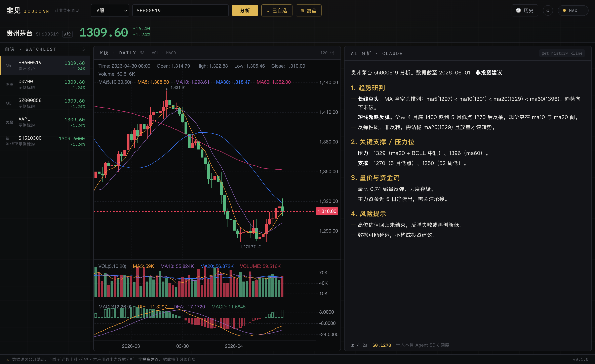

<div align="center">

# JiuJian · 韭见

**Turn your own Claude Code subscription into an AI stock analyst.**

<sub>A privacy-first Electron desktop app for A-share / HK / US / fund analysis, powered by the Claude Code you already pay for.</sub>

[中文 README](README.md) · [License](LICENSE)

   



</div>

## What is this

**JiuJian** feeds live market data from [`stock-sdk`](https://github.com/chengzuopeng/stock-sdk) to **the Claude Code subscription already logged in on your machine**, and renders the AI analysis. The app ships **no API key and routes no request through any server** — every run uses *your own* Claude Code.

> **BYO subscription**: each user runs their own Claude Code. JiuJian only provides the data, the UI, and the orchestration — turning the subscription quota you already pay for (but rarely use up) into stock analysis.

## ✨ Features

- **Single-stock deep analysis** — trend, support/resistance, volume & money flow, risk; streamed markdown report (~**$0.13** per run)
- **End-of-day recap** — one click to review your whole watchlist + the index (~**$0.11** per run)
- **Scheduled auto-recap** — fires automatically after market close + a system notification
- **Runs in the background** — closes to the menu-bar tray, launches at login; recap happens without opening the app
- **Watchlist** with live mini-quotes per row
- **Candlestick charts** — daily K-line + MA / VOL / MACD (red = up, green = down, per CN convention)
- **History** — every analysis and recap is saved for later
- Covers **A-share / Hong Kong / US / funds & ETFs**

## 🧠 How it stays cheap

The core is a cost-optimized data pipeline:

```
renderer → IPC → main process
  main fetches K-line via stock-sdk, computes MA/MACD/BOLL/KDJ/RSI + money flow locally
  → packs a compact data block into the prompt
  → spawns your `claude` headlessly (no MCP) to analyze
  → streams stream-json back to the renderer
```

Letting Claude pull full K-line history through MCP costs **~$1.5** per run. Switching to *"the app feeds a summary, Claude just reasons"* drops it to **$0.13** (~91% cheaper), and is faster and sharper. See [`docs/研究/地基调研.md`](docs/研究/地基调研.md) (Chinese).

## 🚀 Quick start

**Prerequisites**

- [Node.js](https://nodejs.org) ≥ 18, [pnpm](https://pnpm.io)
- [Claude Code](https://code.claude.com/docs) installed and logged in (Pro / Max): `claude auth login`

```bash
pnpm install
pnpm dev          # development
pnpm dist:mac     # build a macOS .dmg (unsigned — right-click → Open on first run)
```

## 💰 Cost

JiuJian is free, but AI analysis **consumes your Claude subscription's quota**:

- From **2026-06-15**, `claude -p` / Agent SDK usage draws from a separate **monthly Agent SDK credit** (Pro $20 / Max 5x $100 / Max 20x $200), billed at API list prices, no rollover. See [Anthropic's note](https://support.claude.com/en/articles/15036540-use-the-claude-agent-sdk-with-your-claude-plan).
- JiuJian is heavily optimized: ~**$0.13** per single-stock analysis, ~**$0.11** per recap. Live cost telemetry is shown after every run.
- Max 20x ($200/mo) ≈ ~1,500 analyses per month.

## ⚠️ Disclaimer

- **BYO subscription**: JiuJian drives *your own*, locally-installed Claude Code. It embeds no key, proxies no credentials. Please follow [Anthropic's terms and usage policy](https://www.anthropic.com/legal/consumer-terms).
- **Not affiliated with Anthropic.** Unofficial project.
- Market data comes from public endpoints and **may be delayed by seconds to minutes**.
- Output is **data analysis, not investment advice**. Use at your own risk.

## 🛠️ Stack

electron-vite · React 18 · TypeScript · Tailwind v4 · [KLineChart](https://github.com/klinecharts/KLineChart) · [stock-sdk](https://github.com/chengzuopeng/stock-sdk) · electron-builder

## 🤝 Contributing

Issues and PRs welcome. This repo is itself built with [Claude Code](https://code.claude.com).

## 📄 License

[MIT](LICENSE) © 2026 JiuJian
